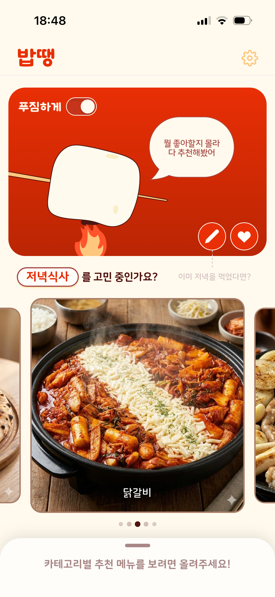
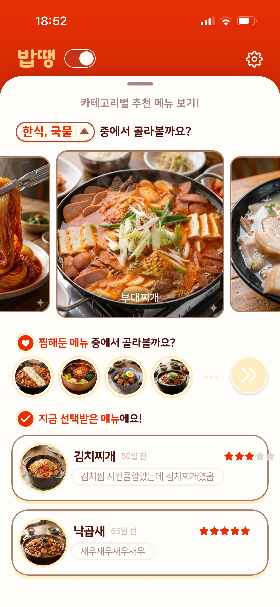
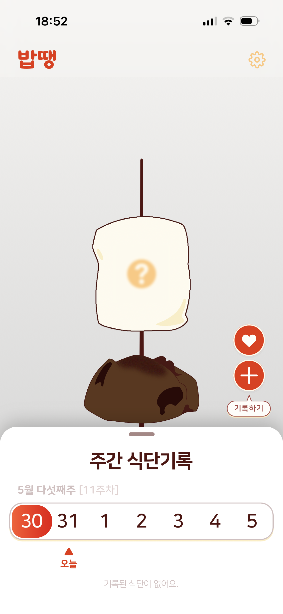
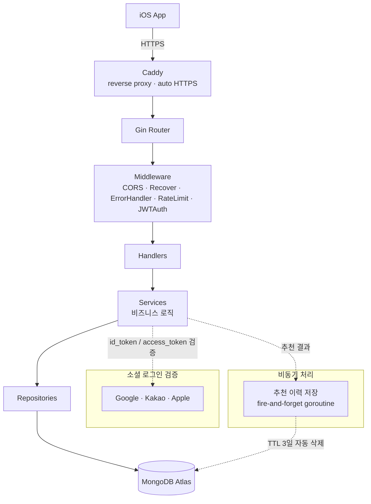

# 밥땡(Bapddang) Backend

> 만족스러운 식사를 위한 무한 식단 추천·기록 앱 밥땡의 API 서버

`밥땡`은 오늘의 식단을 무작위 혹은 카테고리별로 추천받고, 먹은 끼니를 기록하면 일주일치 식사의 만족도에 따라 마시멜로의 굽기가 결정되는 식단 추천·기록 앱입니다.

이 repository는 그 백엔드 API 서버이며, 2025 Happetite Team B에서 **백엔드를 맡아 설계·구현·배포·운영까지 직접 경험한 생애 첫 백엔드 프로젝트**입니다. 프레임워크부터 인프라까지 독학하여 '단순히 동작하는 서버'를 넘어 '운영을 탄탄하게 견디는 서버'로 다듬어가는 것을 목표로 했습니다.

<!-- TODO: App Store에 출시되어 있다면 아래 링크 채우기 -->

### [App Store에서 다운로드](https://apps.apple.com/kr/app/%EB%B0%A5%EB%95%A1/id6759821655)

<p align="center">
  
  
  
</p>

## Core Features

단순 CRUD가 아니라, **'무엇을 먹을지' 추천하는 도메인**과 **식습관을 보상으로 환산하는 게이미피케이션**을 풀어내는 과정에서 나온 설계 결정들이 이 프로젝트의 핵심입니다.

### 1. 개인화 음식 추천 기능

메인 피드의 음식을 단순 랜덤이 아니라, **최근 추천 이력 기반 점수화**로 고르도록 설계하였습니다. 짧은 시간 내에 같은 음식이 여러 번 추천되거나, 같은 카테고리의 음식만 여러 개 추천되는 현상을 방지하기 위한 기능입니다.

- **시간 감쇠 가중치**: 후보를 넉넉히(`count*7`개) 뽑은 뒤, 각 음식이 마지막으로 노출된 시점을 기준으로 가중치를 부여 (1시간 내 `0.01` - 6시간 `0.1` - 18시간 `0.4` - 그 이상 `0.8` - 노출 이력 없음 `1.0`). 최근에 보여준 음식일수록 다시 뽑힐 확률을 낮춥니다.
- **부모 카테고리 다양성**: 점수 정렬 후, 최근 추천에 등장한 상위 카테고리는 제외하며 채워 같은 카테고리의 음식이 한 번에 추천되는 것을 방지하고, 개수가 모자라면 카테고리 제약 없이 fallback 충원합니다.
- **fire-and-forget 저장**: 추천 결과는 응답을 막지 않도록 별도 goroutine + background context로 비동기 기록하고, `recommendation_histories`는 TTL 인덱스로 3일 뒤 자동 삭제됩니다.
- **세부 구현**: [api/services/food.go](api/services/food.go)

### 2. 마시멜로 주간 게이미피케이션 + 날짜 도메인 모델

식사 리뷰를 일주일 단위로 모아, 그 주의 식사 만족도을 0~3단계 마시멜로로 구워 보상합니다.

- **계단형 임계값**: 주간 리뷰 수와 평균 평점을 조합해 상태를 산정 — `3`(노릇노릇) / `2`(나쁘지 않음) / `1`(흰색·기본) / `0`(시커멓게 탐). 많이 먹을수록 더 낮은 평점으로도 좋은 등급에 도달해 꾸준한 기록을 보상하는 구조입니다.
- **day/week 도메인 모델**: 유저별 `day`/`week`를 추적하고, KST 기준으로 주가 바뀌는 순간을 도메인 경계로 삼아 지난주 마시멜로를 확정합니다. 접속하지 않아 비어 있던 주는 공백 마시멜로로 채워 통계의 연속성을 유지합니다.
- **세부 구현**: [utils/marshmallow_status.go](utils/marshmallow_status.go), [api/services/user.go](api/services/user.go)

### 3. 소셜 로그인

Google / Kakao / Apple 로그인을 외부 SDK 없이 **토큰 검증 레벨에서 직접 구현**했습니다.

- **Apple**: `keyfunc`로 Apple JWKS를 받아 `sync.Once`로 캐싱하며 `id_token` 서명을 검증하고 `iss`/`aud`를 확인. 나아가 ES256 client secret을 `.p8` 키(PKCS8 파싱)로 직접 서명해 authorization code를 refresh token으로 교환하고, 회원 탈퇴 시 token revoke까지 처리합니다.
- **세부 구현**: [utils/apple.go](utils/apple.go), [api/services/user.go](api/services/user.go), [api/middleware/auth.go](api/middleware/auth.go)

### 4. N+1 제거 — 반복 단건 조회를 배치 조회로

여러 음식을 다루는 흐름에서 반복적인 단건 쿼리를 걷어내고 배치 연산으로 묶었습니다.

- **리뷰 작성 시 음식 검증**: 이름들을 `$in` 한 번으로 일괄 조회해 map(O(1))으로 매칭하고, 표준 음식에 없는 이름만 커스텀 음식으로 일괄 생성합니다.
- **최근 리뷰 목록**: 리뷰들의 음식 ID를 모아 한 번에 조회한 뒤 map으로 되붙입니다.
- **회원 탈퇴**: 좋아요한 음식들의 `like_count`를 `UpdateMany($inc: -1)`로 일괄 감소시킵니다.
- **세부 구현**: [api/services/food.go](api/services/food.go), [api/services/review.go](api/services/review.go), [api/services/user.go](api/services/user.go)

### 5. 안정적인 운영을 위한 추가 기능

- **Graceful shutdown**: `SIGINT`/`SIGTERM` 수신 시 최대 15초 동안 처리 중인 요청을 마무리하고 종료합니다. `http.Server`에 Read/ReadHeader/Write/Idle 타임아웃을 명시해 느린 연결을 방어합니다. - [main.go](main.go)
- **IP 기반 rate limiting**: `golang.org/x/time/rate` 토큰 버킷을 IP별로 두고, 유휴 클라이언트는 정리 goroutine이 주기적으로 제거해 메모리 누수를 막습니다. 인증 라우트는 1 req/s · burst 20으로 제한합니다. - [api/middleware/rate_limit.go](api/middleware/rate_limit.go)
- **외부 HTTP 타임아웃**: 소셜 IdP 호출 클라이언트에 5초 타임아웃을 둬, 서드파티 지연이 전체 요청을 물고 늘어지지 않게 합니다.

## Tech Stack

| 분류          | 기술                                                 |
| ------------- | ---------------------------------------------------- |
| Language      | Go 1.25                                              |
| Framework     | Gin v1.11                                            |
| Database      | MongoDB (Atlas)                                      |
| Auth          | JWT (HS256) + Social Login (Google / Kakao / Apple)  |
| Documentation | Swagger (swaggo)                                     |
| Infra         | Docker + GitHub Actions - Docker Hub - AWS Lightsail |

## Architecture

**Handler - Service - Repository - MongoDB** 의 layered architecture. 모든 의존성은 인터페이스 기반으로 생성자를 통해 주입하며 [main.go](main.go)에서 조립합니다.



### 디렉터리 구조

```
main.go                  # 엔트리포인트 (DI 조립 + Graceful shutdown)
config/                  # 환경변수 로드/검증
database/                # MongoDB 연결 + 인덱스 보장
apperr/                  # AppError 타입 + 상태코드별 생성자
response/                # 응답 envelope (success / data / error)
models/                  # MongoDB 도큐먼트 모델
api/
  routes/                # 라우트 정의
  handlers/              # HTTP 핸들러 (Gin context 처리)
  services/              # 비즈니스 로직
  repositories/          # MongoDB 데이터 접근
  middleware/            # JWTAuth · ErrorHandler · RateLimit
utils/                   # JWT · Apple 검증 · 마시멜로 상태 · 랜덤
docs/                    # Swagger 자동생성 문서
```

## How to start

### 사전 요구사항

- Go 1.25+
- MongoDB (로컬 Docker 또는 Atlas)

### 로컬 실행

```bash
# 1. 의존성 설치
go mod download

# 2. 환경변수 설정 - 루트에 .env 파일을 만들고 아래 "환경변수" 표를 채웁니다

# 3. 서버 실행
go run main.go

# (선택) 소셜 로그인 콜백 등 외부 노출이 필요할 때 — ngrok 포함 개발 스크립트
./dev.sh

# 빌드
go build -o bapddang-server .
```

Swagger 문서는 서버 실행 후 `http://localhost:8080/swagger/index.html` 에서 확인할 수 있습니다 (production 환경에서는 비활성화).

### 환경변수

| 변수                   | 설명                                                                                     |
| ---------------------- | ---------------------------------------------------------------------------------------- |
| `PORT`                 | 서버 포트 (기본 `8080`)                                                                  |
| `APP_ENV`              | 환경 (`development` / `production`) — production에서는 Swagger 비활성화 + `JWT_KEY` 필수 |
| `MONGO_URI`            | MongoDB 연결 URI (기본 `mongodb://localhost:27017`)                                      |
| `DB_NAME`              | DB 이름 (기본 `bapddang-dev`)                                                            |
| `JWT_KEY`              | JWT 서명 키 (**production 필수**)                                                        |
| `GOOGLE_WEB_CLIENT_ID` | Google `id_token`의 `aud` 검증용 Client ID                                               |
| `KAKAO_ADMIN_KEY`      | Kakao REST(Admin) Key — 사용자 조회/unlink                                               |
| `APPLE_BUNDLE_ID`      | Apple Client ID (`id_token` `aud` + client secret `sub`)                                 |
| `APPLE_P8_KEY`         | Apple 비공개 키 (PEM, ES256 client secret 서명용)                                        |
| `APPLE_TEAM_ID`        | Apple Team ID (client secret `iss`)                                                      |
| `APPLE_KEY_ID`         | Apple Key ID (client secret `kid`)                                                       |

## API Spec

모든 응답은 일관된 envelope 형식을 따릅니다.

```jsonc
{ "success": true, "data": { ... } } // success
{ "success": false, "error": { "code": "BAD_REQUEST", "message": "..." } } // fail
```

에러는 중앙 `ErrorHandler` 미들웨어가 `AppError`를 받아 상태코드 + `code`(`UNAUTHORIZED`, `NOT_FOUND`, `CONFLICT`, `TOO_MANY_REQUESTS` 등)로 변환합니다. 내부 원인(raw error)은 로깅만 하고 클라이언트에는 노출하지 않습니다.

`/api/v1` 하위 주요 엔드포인트:

| 그룹           | 주요 엔드포인트                                                                              | 설명                                    |
| -------------- | -------------------------------------------------------------------------------------------- | --------------------------------------- |
| `auth`         | `POST /auth/signup` · `/login` · `/google` · `/kakao` · `/apple`, `GET /auth/check-username` | 로컬/소셜 회원가입·로그인, JWT 발급     |
| `users`        | `GET /users/me`, `PATCH /users/me/password` · `/agreement` · `/sync`, `DELETE /users/me`     | 내 정보·비밀번호·약관·일/주 동기화·탈퇴 |
| `foods`        | `GET /foods/:foodID` · `/main-feed` · `/category`, `POST /foods/resolve`                     | 음식 조회·추천 피드·카테고리·이름 해석  |
| `likes`        | `POST`/`DELETE /foods/:foodID/likes`, `GET /users/me/liked-foods`                            | 음식 좋아요/취소·목록                   |
| `reviews`      | `POST /reviews`, `PATCH`/`DELETE /reviews/:reviewID`, `GET /reviews/recent`                  | 식사 리뷰 CRUD·최근 리뷰 조회           |
| `marshmallows` | `GET /marshmallows`                                                                          | 주간 마시멜로 조회                      |

`auth`를 제외한 라우트는 `Authorization: Bearer <JWT>` 헤더가 필요하고, `auth` 그룹에는 IP 기반 rate limiting이 적용됩니다. 전체 명세는 Swagger 참고.
